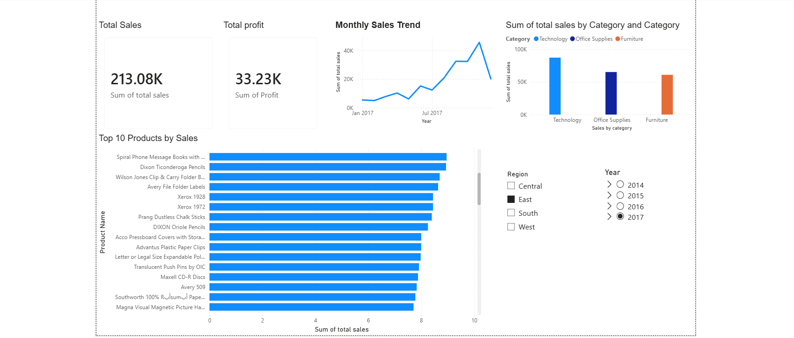

# AI-Assisted Retail Sales Analytics

## 📌 Project Overview

This project demonstrates an end-to-end retail analytics workflow using Python and Power BI.

The objective is to clean, analyze, and extract actionable business insights from retail sales data using an AI-assisted approach.

---

## 🚀 Key Features

- Data Cleaning & Preprocessing using Python  
- Exploratory Data Analysis (EDA)  
- Sales Performance Analysis  
- Profit & Revenue Insights  
- Interactive Power BI Dashboard  
- Business Recommendation Generation  

---

## 🛠 Tech Stack

- Python (Pandas, NumPy, Matplotlib)  
- Power BI  
- SQL  
- Git & GitHub  

---

## 📊 Dashboard Insights

The Power BI dashboard provides:

- Total Sales Overview  
- Profit Analysis  
- Region-wise Performance  
- Category-wise Sales Breakdown  
- Trend Analysis Over Time  

---

---

## 🎯 Business Impact

This project demonstrates how data analytics can help businesses:

- Identify high-performing products  
- Detect low-profit regions  
- Optimize pricing strategies  
- Improve data-driven decision-making  

---

## 👨‍💻 Author

Abhyudaya Mahapatra  
Aspiring Data Analyst | Python | Power BI | SQL

## 📂 Project Structure
